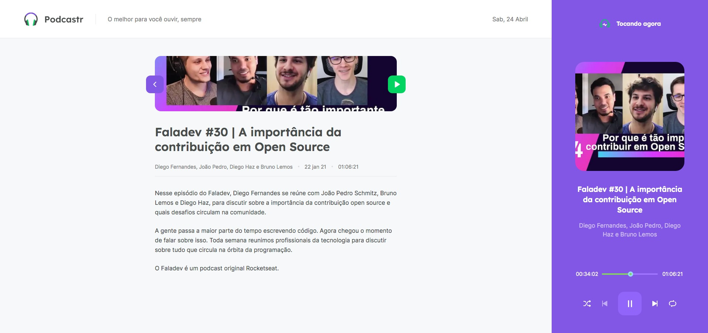
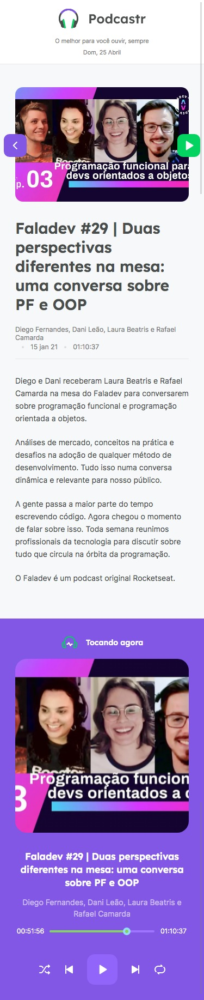

# Podcastr
Projeto desenvolvido com **reactJS** **nextJS** no #NLW5 da @rocketseat trilha #reactJS

## Tecnologias
Tecnologias aplicadas para desenvolver este projeto

- React.js
- Next.js
- Typescript

### Vídeo
[](https://youtu.be/FS2h-jUdjuM)

## O Projeto
Para baixar o projeto e conferir na sua máquina:
```bash
# Clone o projeto
$ git clone https://github.com/juslenelobeu/nlw5.podcastrnext.git

# Instale as dependências dentro do projeto
$ yarn

# Para rodar o servidor
$ yarn server

# Para rodar o sistema
$ yarn dev
```
## ScreenShot

### Home

### Single Page

### Mobile
 